<h1 align="center">Hi 👋, I'm Osama Mohamed</h1>

<h3 align="center">
Software Engineer | Flutter Developer
</h3>

  Building scalable and user-focused mobile applications with Flutter, clean architecture, and modern software engineering practices.

  
  
  

---

## About Me

I am a Software Engineer specializing in Flutter and Dart, focused on building scalable, maintainable, and user-centered mobile applications.

I have hands-on experience with Clean Architecture, BLoC/Cubit state management, RESTful API integration, Firebase services, localization, and responsive UI development.

I also have a strong foundation in object-oriented programming and desktop application development using C++ and Java.

---

## Tech Stack

### Mobile Development

  

### Architecture & State Management

* Clean Architecture
* BLoC / Cubit
* RESTful APIs
* Responsive UI
* Localization (Arabic & English)

### Backend & Services

  

### Programming Languages

  

### Databases

  

### Development Tools

  

---

## Featured Projects

### 1. Home Services App

**Production mobile application developed for a Saudi client at TwinTech IT.**

A mobile platform designed to simplify the discovery and booking of home services through a responsive and user-friendly experience.

#### Key Contributions

* Developed features using **Flutter & Dart**.
* Applied **Clean Architecture** to improve scalability and maintainability.
* Implemented **BLoC / Cubit** for predictable state management.
* Integrated **RESTful APIs** for application data and backend communication.
* Implemented **Arabic & English localization** with adaptive UI.
* Built reusable and responsive Flutter components.
* Contributed to production-ready application flows and user experience.

**Technologies:** Flutter · Dart · Clean Architecture · BLoC/Cubit · REST APIs · Localization

#### Screenshots

  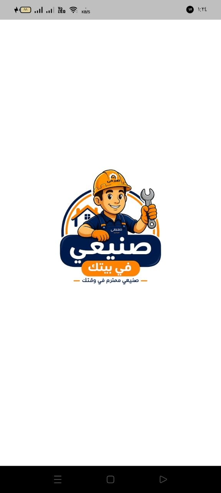
  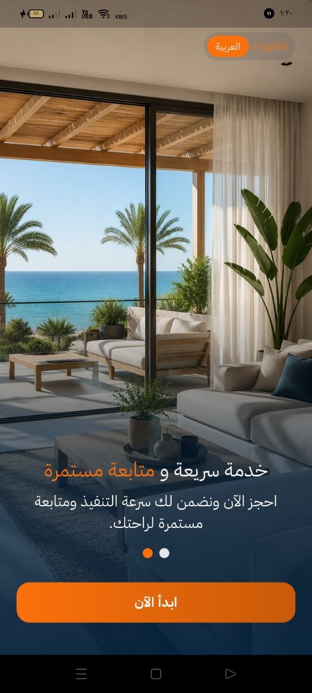
  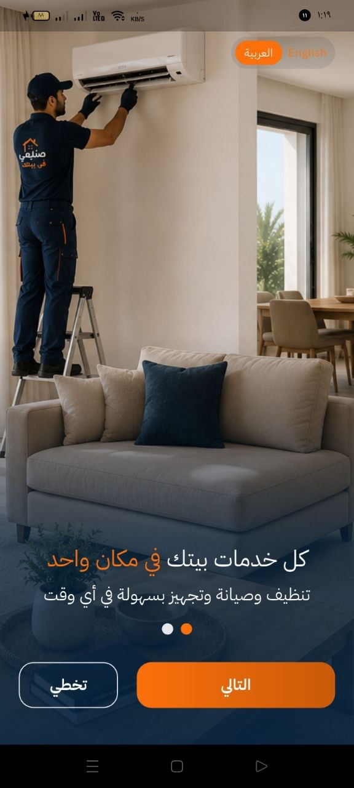
  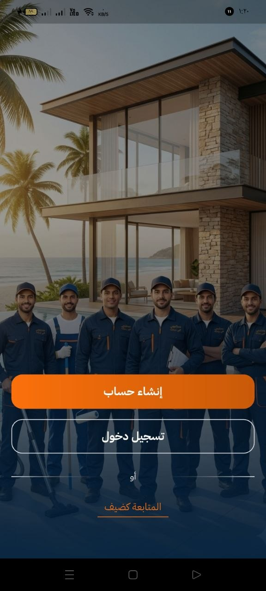

---

### 2. E-Commerce Mobile App

A Flutter-based e-commerce application implementing product discovery, cart management, order review, shipping location, and checkout workflows.

#### Key Features

* Dynamic product catalog with category browsing and search.
* REST API integration for product data.
* Product details and order review workflows.
* Shopping cart with dynamic state management using Cubit.
* Shipping location and map integration.
* Payment and checkout workflow.
* Responsive and reusable Flutter UI components.
* Clean Architecture for maintainable application structure.

**Technologies:** Flutter · Dart · Cubit · REST APIs · Clean Architecture

#### Screenshots

  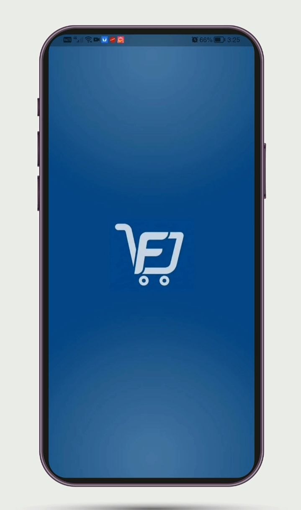
  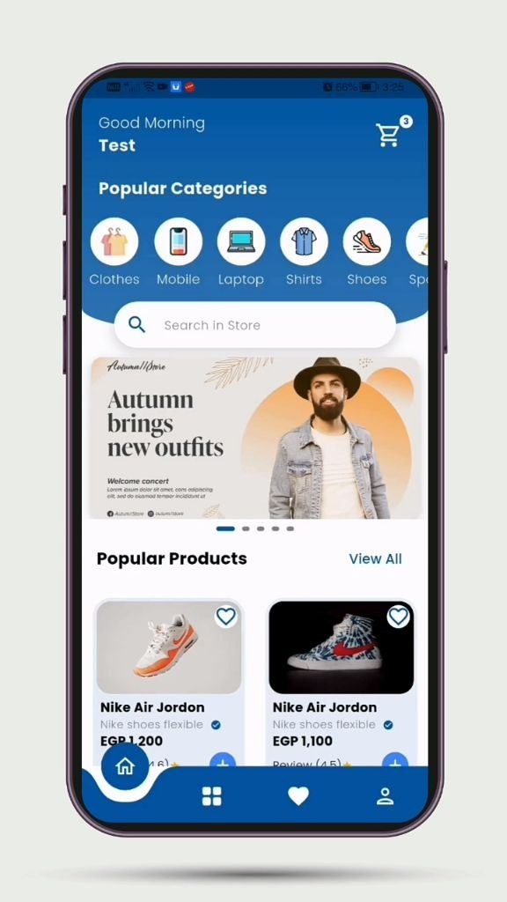
  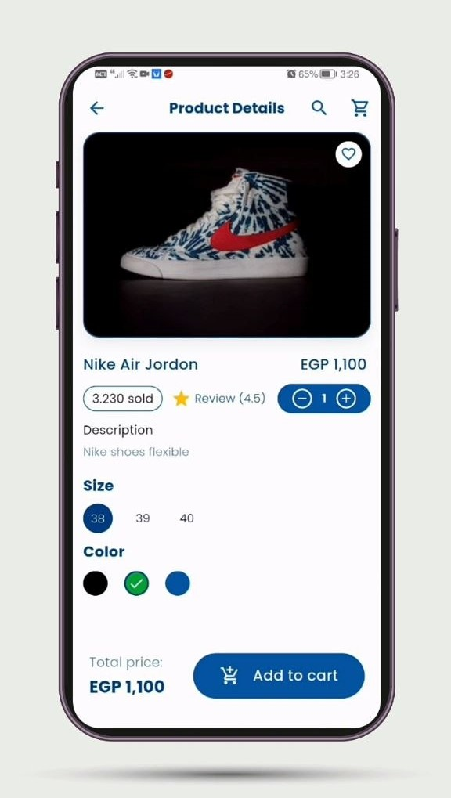

  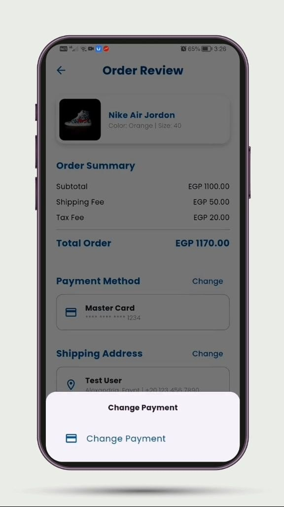
  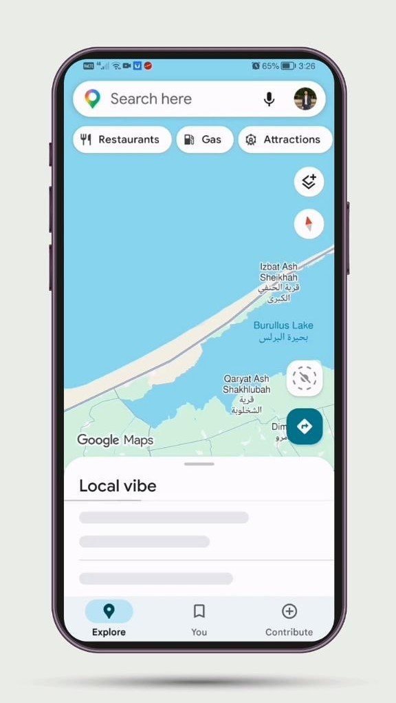
  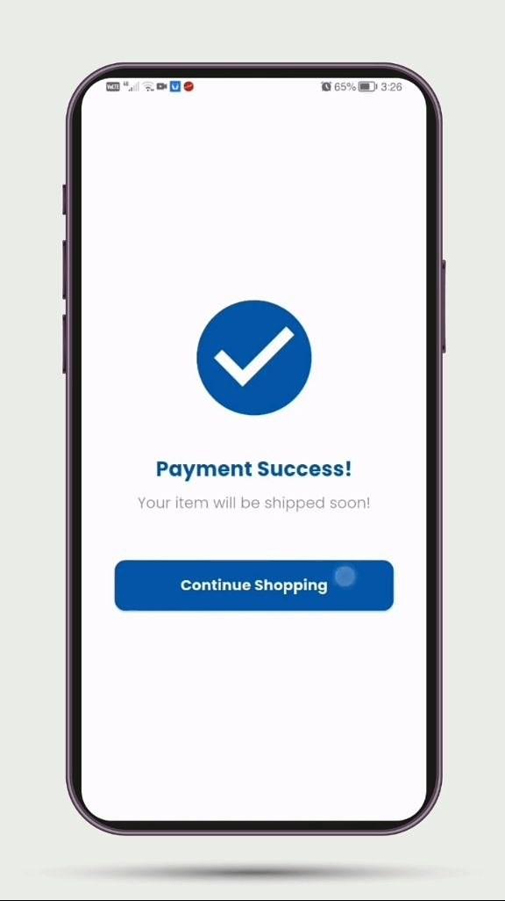

---

### 3. Hospital Management System

A desktop application designed to manage healthcare operations, including patients, doctors, departments, and related medical data.

#### Key Features

* Patient and doctor management.
* Department and healthcare data management.
* Desktop graphical user interface.
* Object-oriented application structure.
* Local database integration using SQLite.
* Structured data management for healthcare workflows.

**Technologies:** C++ · Qt Framework · SQLite · Object-Oriented Programming

#### Screenshots

  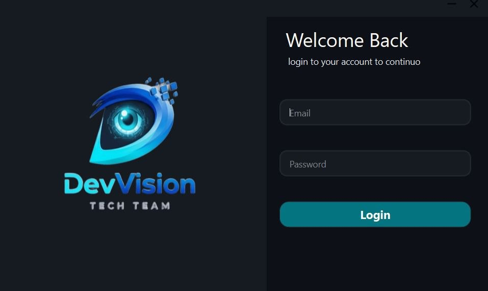
  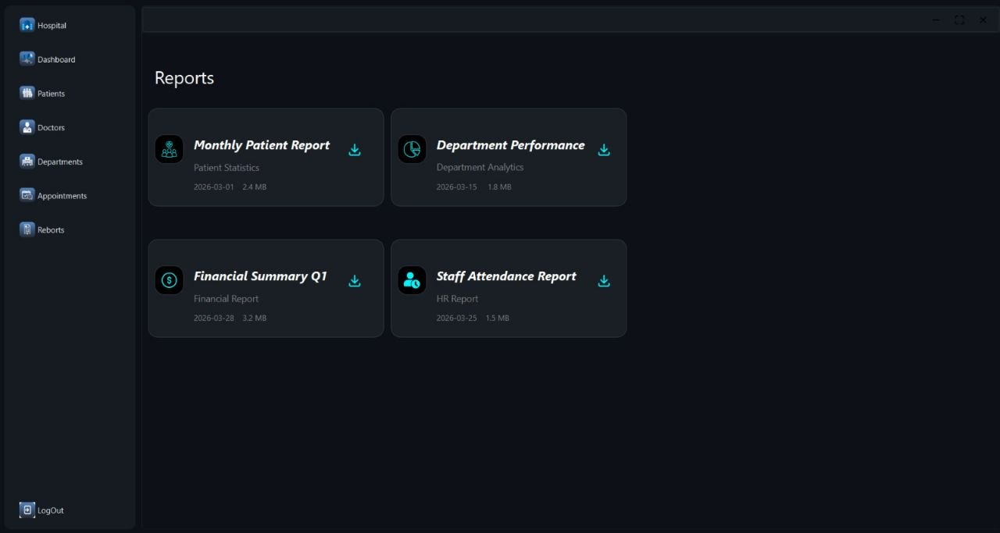
  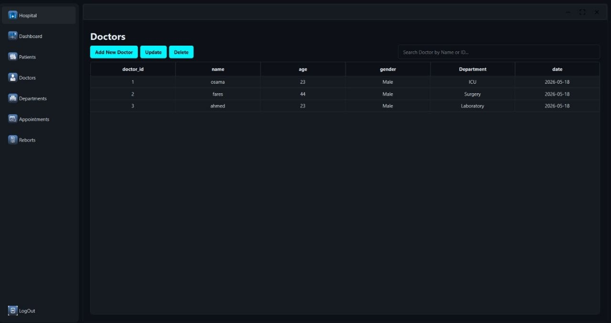

  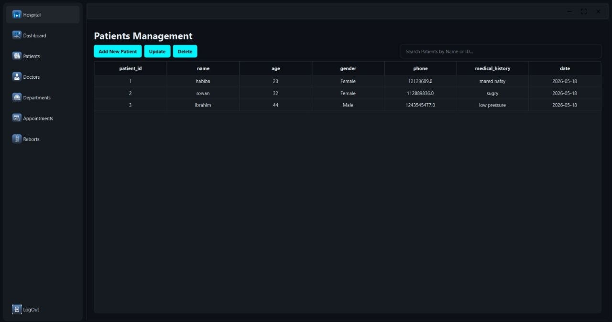
  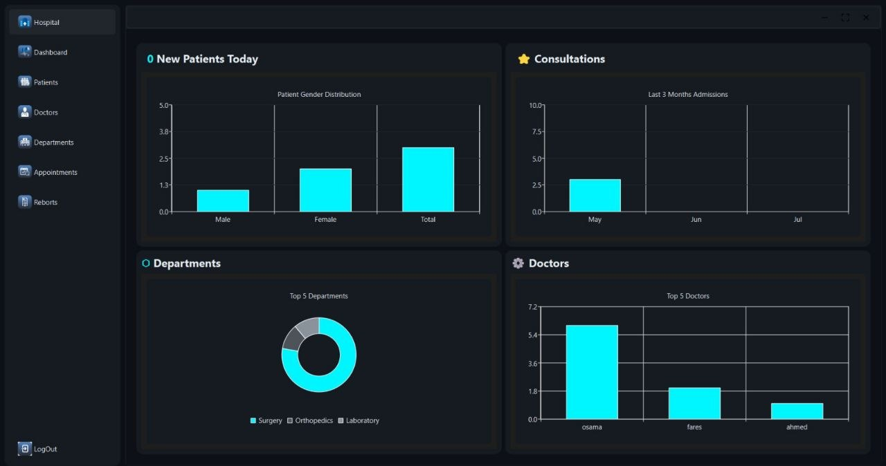
  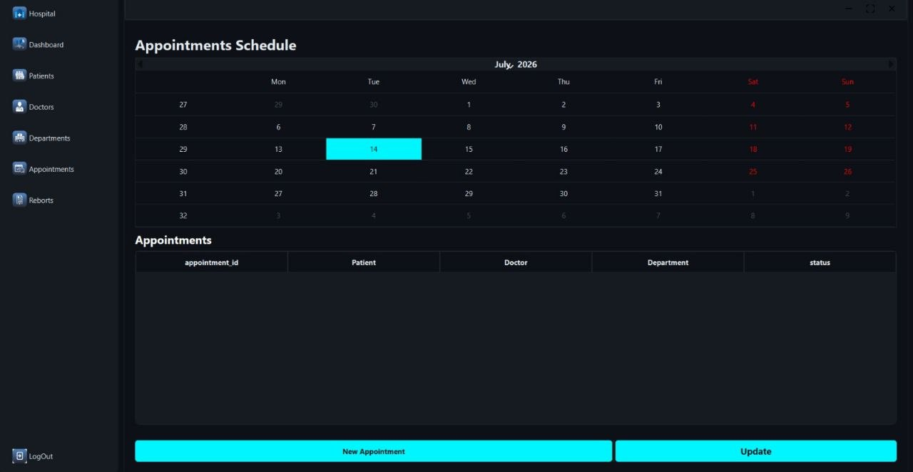

---

## Professional Experience

### Flutter Developer — TwinTech IT

**Alexandria, Egypt · 2026**

Contributed to a production mobile application developed for a Saudi client.

* Developed and maintained Flutter features using **Dart**.
* Applied **Clean Architecture** to organize application layers.
* Implemented **BLoC / Cubit** for state management.
* Integrated **RESTful APIs** and handled application data flows.
* Implemented **Arabic & English localization**.
* Developed reusable and responsive UI components.
* Contributed to production-ready application workflows.

**Technologies:** Flutter · Dart · BLoC/Cubit · Clean Architecture · REST APIs · Localization

---

## Engineering Focus

* Scalable Flutter application development
* Clean and maintainable software architecture
* State management with BLoC / Cubit
* REST API integration
* Firebase services
* Responsive UI development
* Localization and multilingual applications
* Object-oriented programming
* Software engineering fundamentals

---

## Connect With Me

  
  
  

  </a>

